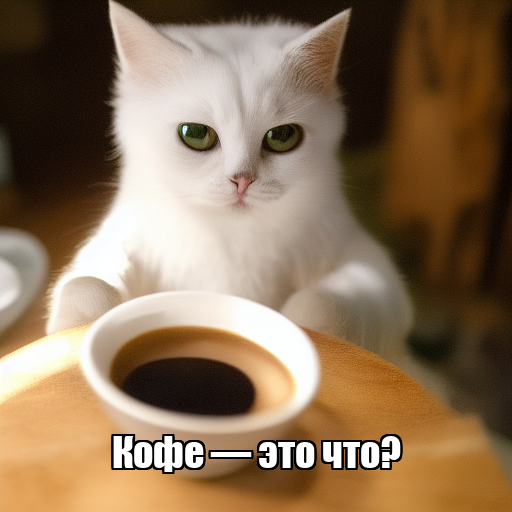
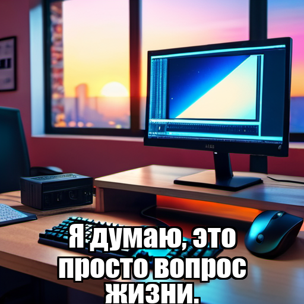

# 🧠 Memology-ML — AI Meme Generation Engine

[](https://www.python.org/downloads/)
[](https://opensource.org/licenses/MIT)

[🇷🇺 Русская версия](README_RU.md)

**Memology-ML** is the core machine learning component of the **Memology** project — an AI-powered meme generation platform. This module creates **visual meme content** and **funny captions** using Stable Diffusion WebUI and Ollama (LLaMA 3.2). All processing runs **locally**, so your memes are created **privately and offline**.

## 📋 Table of Contents

- [Example Memes](#-example-memes)
- [Features](#-features)
- [Architecture](#-architecture)
- [Requirements](#-requirements)
- [Installation](#installation)
- [Setup](#-setup)
  - [Ollama Setup](#-ollama-setup)
  - [Stable Diffusion WebUI Setup](#-stable-diffusion-webui-setup)
  - [Docker Setup (recommended)](#-docker-setup-recommended)
- [Configuration](#configuration)
- [Usage](#-usage)
- [API Documentation](#-api-documentation)
- [Development](#development)
- [Troubleshooting](#-troubleshooting)
- [Contributing](#-contributing)

## 🎨 Example Memes

| Input Idea                | Generated Meme                                               |
| ------------------------- | ------------------------------------------------------------ |
| "кот пьет кофе"           |  |
| "лошадь чихнула"          |                  |
| "компьютер и ежу понятен" |            |

## ✨ Features

- 🖼️ **High-quality local generation** — All processing happens on your machine
- 🎨 **Multiple visual styles** — Realistic, anime, cartoon, cyberpunk, fantasy, and more
- 🧠 **Smart prompt engineering** — Automatic English prompts from Russian ideas
- 😂 **Witty captions** — Short, funny Russian captions generated by AI
- ✍️ **Automatic text overlay** — Professional meme-style text with Impact font
- 📊 **Comprehensive logging** — Full generation process tracking
- 🏗️ **Clean OOP architecture** — Modular, testable, and extensible codebase
- ⚙️ **Flexible configuration** — Environment variables and config files support
- 🐳 **Docker support** — Run locally or in containers with all dependencies
- 🚀 **FastAPI integration** — REST API for meme generation
- 📈 **Scalable** — Multiple service instances supported

## 🏗️ Architecture

The project follows modern **Object-Oriented Programming** principles with clear separation of concerns:

```
memology-ml/
├── src/
│   ├── config/          # Configuration management
│   ├── core/            # LLM and image generation abstractions
│   ├── services/        # Business logic (prompts, captions, orchestration)
│   ├── utils/           # Helper utilities (logging, image processing)
│   └── models/          # Data models and structures
├── tests/               # Unit tests
├── examples/            # Example memes
├── generated_images/    # Output directory
├── docker-compose.yml   # Docker Compose configuration
├── Dockerfile          # Docker image for API service
├── Dockerfile.ollama   # Docker image for ollama
├── main.py             # Application entry point
├── requirements.txt    # Python dependencies
└── README.md          # This file
```

## 📦 Requirements

### 💻 System Requirements

#### Minimum Configuration (CPU Only)

- **CPU**: 4+ cores (Intel i5-8xxx / AMD Ryzen 5 3xxx or equivalent)
- **RAM**: 12 GB
  - Ollama LLaMA 3.2 (3B): 4-6 GB
  - Stable Diffusion WebUI: 4-6 GB
  - System + Services: 2-4 GB
- **GPU**: Not required (CPU inference supported)

**Expected performance:** 5-10 minutes per meme generation

---

#### Recommended Configuration (GPU Accelerated)

- **CPU**: 6+ cores (Intel i7-10xxx / AMD Ryzen 7 5xxx or better)
- **RAM**: 16 GB
- **GPU**: NVIDIA GPU with 6+ GB VRAM
  - **Minimum**: GTX 1660 Ti (6 GB VRAM)
  - **Recommended**: RTX 3060 (12 GB VRAM)
  - **Optimal**: RTX 4070/4080 (12-16 GB VRAM)

**Expected performance:** 15-60 seconds per meme generation

---

#### Docker Requirements

- **RAM**: 16 GB minimum (24 GB recommended for multi-service setup)
- **CPU**: Same as above
- **GPU**: Optional, requires NVIDIA Docker runtime + CUDA support

### For Local Development:

- **Python** 3.13+
- **Ollama** with LLaMA 3.2 model
- **Stable Diffusion WebUI** (AUTOMATIC1111)
- **Impact font** (`impact.ttf`)

### For Docker:

- Docker Engine 20.10+
- Docker Compose 2.0+
- Minimum 8 GB RAM (16 GB recommended for ML models)
- NVIDIA GPU (optional, for acceleration)

## Installation

### 🐳 Docker installation (Recomended)

#### 1️⃣ Clone the repository

```bash
git clone https://github.com/TAskMAster339/memology-ml.git
cd memology-ml
```

#### 2️⃣ Configure .env file like .env.example

Edit the `.env` file according to your requirements:

```env
# API Configuration
API_HOST=0.0.0.0
API_PORT=8000
DEBUG=False

# Model Configuration
OLLAMA_MODEL=alibayram/smollm3
OLLAMA_HOST=http://ollama:11434
OLLAMA_TIMEOUT=15

# Stable Diffusion Configuration
SD_BASE_URL=http://sd-webui:7860
SD_STEPS=20
SD_WIDTH=512
SD_HEIGHT=512
SD_SAMPLER=DPM++ 2M Karras
SD_CFG_SCALE=7.0

# Application Settings
OUTPUT_DIR=generated_images
LOG_FILE=generation.log
FONT_PATH=impact.ttf
```

#### 3️⃣ Install Stable Diffusion WebUI

##### Install WebUI

👉 [https://github.com/AUTOMATIC1111/stable-diffusion-webui](https://github.com/AUTOMATIC1111/stable-diffusion-webui)

##### Run WebUI with API enabled

```bash
python launch.py --api
```

This starts the API at: `http://127.0.0.1:7860/sdapi/v1/txt2img`

#### 4️⃣ Run Dcoker containers

```bash
docker compose up -d
```

\*Make sure that Stable diffusion is running locally or in Docker with [stable-diffusion-webui-docker-master](stable-diffusion-webui-docker-master/docker-compose.yml)

This command will start all services defined in `docker-compose.yml`:

- **API Service**: available at `http://localhost:8000`
- **Swagger UI**: available at `http://localhost:8000/docs`
- **Ollama Service**: available at `http://localhost:11434`
- **Stable Diffusion WebUI**: available at `http://localhost:7860`

##### Ports and Application URLs

| Service          | Port  | URL                          | Description                   |
| ---------------- | ----- | ---------------------------- | ----------------------------- |
| API Service      | 8000  | http://localhost:8000        | Main API service              |
| Swagger UI       | 8000  | http://localhost:8000/docs   | Interactive API documentation |
| ReDoc            | 8000  | http://localhost:8000/redoc  | Alternative API documentation |
| Health Check     | 8000  | http://localhost:8000/health | API health status check       |
| Ollama Service   | 11434 | http://localhost:11434       | LLM model service             |
| Stable Diffusion | 7860  | http://localhost:7860        | Image generation WebUI        |

#### Now you can use it with [Swagger](http://localhost:8000/docs) or curl.

### 🎨 Local installation (For developing)

#### 1️⃣ Clone the repository

```bash
git clone https://github.com/TAskMAster339/memology-ml.git
cd memology-ml
```

#### 2️⃣ Create python virtual environment

```bash
# Linux / macOS
python -m venv venv
source venv/bin/activate

# Windows
python -m venv venv
venv\Scripts\activate
```

#### 3️⃣ Install dependencies

```bash
pip install -r requirements.txt
```

#### 🦙 Ollama Setup

##### Install Ollama

👉 [https://ollama.com/download](https://ollama.com/download)

##### Pull the LLaMA 3.2 model

```bash
ollama pull alibayram/smollm3
```

\*You can use another model

Verify installation:

```bash
ollama run alibayram/smollm3
```

Ollama will run at: `http://localhost:11434`

#### 🎨 Stable Diffusion WebUI Setup

##### 1️⃣ Install WebUI

👉 [https://github.com/AUTOMATIC1111/stable-diffusion-webui](https://github.com/AUTOMATIC1111/stable-diffusion-webui)

##### 2️⃣ Run WebUI with API enabled

```bash
python launch.py --api
```

This starts the API at: `http://127.0.0.1:7860/sdapi/v1/txt2img`

##### 3️⃣ (Optional) Add custom models

Download additional models from [Civitai](https://civitai.com/):

| Model            | Style                      | Link                                                        |
| ---------------- | -------------------------- | ----------------------------------------------------------- |
| **Memes XL**     | Meme-style, funny, vibrant | [Download](https://civitai.com/models/205229/memes-xl)      |
| **Crazy Horror** | Dark, surreal, horror      | [Download](https://civitai.com/models/1101129/crazy-horror) |

Place downloaded `.safetensors` files into:

```
stable-diffusion-webui/models/Stable-diffusion/
```

#### 4️⃣ Run project-demo

```bash
python main.py
```

## Configuration

Create a `.env` file in the project root (see `.env.example`):

```env
# Ollama Configuration
OLLAMA_MODEL=alibayram/smollm3
OLLAMA_TIMEOUT=15
OLLAMA_HOST=http://localhost:11434

# Stable Diffusion Configuration
SD_BASE_URL=http://127.0.0.1:7860
SD_STEPS=20
SD_WIDTH=512
SD_HEIGHT=512
SD_SAMPLER=DPM++ 2M Karras
SD_CFG_SCALE=7.0
SD_RESTORE_FACES=True

# Application Settings
OUTPUT_DIR=generated_images
LOG_FILE=generation.log
FONT_PATH=impact.ttf
```

### Configuration Options

| Parameter                | Description                   | Default             |
| ------------------------ | ----------------------------- | ------------------- |
| `OLLAMA_MODEL`           | LLM model name                | `alibayram/smollm3` |
| `OLLAMA_TIMEOUT`         | LLM request timeout (seconds) | `15`                |
| `SD_STEPS`               | Diffusion steps               | `20`                |
| `SD_WIDTH` / `SD_HEIGHT` | Image dimensions              | `512x512`           |
| `SD_SAMPLER`             | Sampling method               | `DPM++ 2M Karras`   |
| `SD_CFG_SCALE`           | Prompt adherence strength     | `7.0`               |

## 🚀 Usage

### Basic Usage (Local)

```bash
python main.py
```

The application will generate memes for predefined examples and save them to `generated_images/`.

### Using Docker

Generate memes using FastAPI:

```bash
# Start services
docker compose up -d

# Access Swagger UI
# Open http://localhost:8000/docs in your browser

# Generate a meme via API
curl -X POST "http://localhost:8000/api/v1/generate" \
  -H "Content-Type: application/json" \
  -d '{
    "prompt": "Кот пьет кофе",
    "style": "realistic"
  }'
```

### Programmatic Usage

```python
from src.services.meme_service import MemeService
from main import create_meme_service

# Initialize the service
meme_service = create_meme_service()

# Generate a meme
result = meme_service.generate_meme("кот пьет кофе")

if result.success:
    print(f"Meme created: {result.final_image_path}")
    print(f"Caption: {result.caption}")
else:
    print(f"Error: {result.error_message}")
```

### Custom Styles

```python
from src.models.meme import MemeStyle

# Define custom style
custom_style = MemeStyle(
    name="retro",
    description="retro 80s style, neon colors, vaporwave aesthetic"
)

# Generate with custom style
result = meme_service.generate_meme("кот в космосе", style=custom_style)
```

## 📊 Logging

Each generation is logged to `logs/`:

```
2025-10-26 23:56:10 | src.services.meme_service | INFO | Starting meme generation: 9e0bbf0f
2025-10-26 23:56:22 | src.services.prompt_service | INFO | Generated prompt: A cat drinking coffee...
2025-10-26 23:56:24 | src.services.caption_service | INFO | Generated caption: Кот просто не умеет
2025-10-26 23:58:24 | src.services.meme_service | INFO | Meme generation completed in 134.12s
```

## 📚 API Documentation

### FastAPI Endpoints

After starting with Docker, API documentation is available at:

- **Swagger UI**: http://localhost:8000/docs

Main API endpoints for meme generation:

- _/api/memes/generate-template_ – create typical memes using [templates](https://github.com/jacebrowning/memegen)
- _/api/memes/generate_ – create memes using Stable Diffusion
- _/api/memes/styles_ – list of available meme styles
- _/api/memes/task/{task_id}_ – get the status of meme generation by task*id, which is returned after a request to */api/memes/generate\_
- _/api/memes/task/{task_id}/result_ – retrieve the generated meme

## Development

### Project Structure Philosophy

The project follows **SOLID principles** and clean architecture:

- **Single Responsibility** — Each class has one clear purpose
- **Open/Closed** — Open for extension, closed for modification
- **Dependency Injection** — Dependencies passed via constructors
- **Separation of Concerns** — Business logic separated from infrastructure

### Adding New Features

**Example: Add a new LLM provider**

1. Create a new class in `src/core/llm_client.py`:

```python
class OpenAIClient(BaseLLMClient):
    def generate(self, messages, timeout=None):
        # Implementation
        pass
```

2. Update `main.py` to use the new client:

```python
llm_client = OpenAIClient(api_key=config.openai_api_key)
```

**Example: Add a new image style**

1. Add to `src/models/meme.py`:

```python
PREDEFINED_STYLES.append(
    MemeStyle("steampunk", "steampunk art, Victorian era, brass and copper")
)
```

### Update Dependencies

```bash
# Update requirements.txt
pip freeze > requirements.txt

# Rebuild Docker image
docker compose build
```

### Code Quality Checks

```bash
# Linting
flake8 app/
black app/ --check
mypy app/

# Formatting
black app/
isort app/
```

## 🐛 Troubleshooting

### Common Issues

**Issue:** `ReadTimeout: HTTPConnectionPool(host='127.0.0.1', port=7860)`

**Solution:**

- Ensure Stable Diffusion WebUI is running with `--api` flag
- Check that WebUI is accessible at [http://127.0.0.1:7860](http://127.0.0.1:7860)

**Issue:** `ConnectionRefusedError` for Ollama

**Solution:**

- Start Ollama: `ollama serve`
- Verify model is installed: `ollama list`
- Ensure Ollama is running on correct port (11434)

**Issue:** Text doesn't fit on image

**Solution:**

- Font file missing — ensure `impact.ttf` exists
- Reduce caption length in prompt

**Issue:** Container won't start

```bash
# Check logs
docker compose logs api

# Check container status
docker compose ps
```

**Issue:** Model won't load in Docker

```bash
# Check Ollama service availability
curl http://localhost:11434/api/tags

# Restart model service
docker compose restart ollama
```

**Issue:** Port already in use

Change ports in `.env` file or `docker-compose.yml`:

```yaml
services:
  api:
    ports:
      - "8080:8000" # Change external port
```

**Issue:** Insufficient memory

Increase limits in `docker-compose.yml`:

```yaml
services:
  api:
    deploy:
      resources:
        limits:
          memory: 8G
```

## 💡 Tips & Optimization

- **Faster generation:** Reduce `SD_STEPS` to `10-15`
- **Better quality:** Use SDXL models or increase steps to `30-40`
- **Dark memes:** Try the "Crazy Horror" model
- **Anime style:** Use "Anything V5" model
- **Everything works offline** — No API keys required!

## 🤝 Contributing

Contributions are welcome! Here's how:

1. Fork the repository
2. Create a feature branch (`git checkout -b feature/amazing-feature`)
3. Make your changes following the project structure
4. Add tests for new functionality
5. Run tests: `pytest tests/`
6. Commit changes (`git commit -m 'Add amazing feature'`)
7. Push to branch (`git push origin feature/amazing-feature`)
8. Open a Pull Request to the `dev` branch

### Code Style

- Follow PEP 8 guidelines
- Use type hints
- Add docstrings to public methods
- Keep classes focused and small

## 📄 License

This project is licensed under the MIT License - see the [LICENSE](LICENSE) file for details.

## 🙏 Acknowledgments

- [Ollama](https://ollama.com/) — Local LLM runtime
- [AUTOMATIC1111](https://github.com/AUTOMATIC1111/stable-diffusion-webui) — Stable Diffusion WebUI
- [Stability AI](https://stability.ai/) — Stable Diffusion model
- [Memegen](https://github.com/jacebrowning/memegen)

## 📬 Contact

Project Link: [https://github.com/TAskMAster339/memology-ml](https://github.com/TAskMAster339/memology-ml)

---

**Built with ❤️ and AI** | Made for meme enthusiasts and ML practitioners
